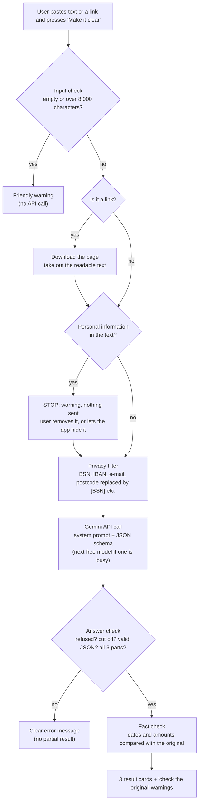

# ClearForMe

**Difficult text, made clear.**

ClearForMe is a simple web app for people who struggle to read formal text. You paste in a difficult text — or a **link** to a difficult web page — press **Make it clear**, and you get back:

1. **Simple explanation**: the text rewritten in plain, everyday language (level B1).
2. **What do I need to do?**: the concrete steps and deadlines, if there are any.
3. **Difficult words explained**: the hard words from the text, each with one plain sentence.

It works for **Dutch** and **English** texts. It is a *companion* to the original document, not a replacement: the reader keeps the original and can always compare.

Built for *AI for Good, Hackathon 3: Equal Access* (SDG 10, Reduced Inequalities), with Python, Streamlit and Google's Gemini API (free tier).

> TODO (team): add a screenshot of the app with a result, e.g. `docs/screenshot.png`.

---

## 1. The problem

> Draft. Team: check it, add your sources and make it your own.

Official letters decide things that matter: a fine, a benefit, a deadline, a right to object. They are often written in formal, bureaucratic language full of legal terms. For example, this sentence from our (fictional) sample letter:

> *"Indien de gevraagde gegevens niet tijdig dan wel onvolledig worden ontvangen, kunnen wij uw aanvraag op grond van artikel 4:5 van de Algemene wet bestuursrecht (Awb) buiten behandeling laten."*

In plain Dutch this means: *"Als u de papieren niet op tijd of niet compleet stuurt, kijken wij niet naar uw aanvraag."* Someone who does not understand the first version can lose money they are entitled to, simply because of the language the letter was written in.

- **What goes wrong:** people miss deadlines, obligations and rights because they cannot understand the letter, or they depend on others to read their post for them.
- **For whom:** adults with low literacy, people who are still learning Dutch or English, and people with cognitive or learning difficulties.
- **Where:** letters and websites from Dutch government organisations (municipality, tax office, benefit agencies), and official English notices and e-mails.
- **When:** the moment a letter arrives, often with a deadline of a few weeks. Help (a family member, a social worker, a library help desk) is not always available at that moment.
- **Data:** TODO (team): add a sourced figure. For example, Stichting Lezen & Schrijven reports that about 2.5 million people aged 16 and over in the Netherlands have difficulty reading and writing. *Verify this number and add the link.*

**SDG 10 link:** target 10.2 (social, economic and political inclusion of all) and target 10.3 (equal opportunity). If you cannot understand official communication, you cannot use the rights and services that everyone else can.

## 2. Who it is for, and who it is not for

> Draft. Team: check it and make it your own.

**Users:**
- **Adults with low literacy** who receive Dutch government letters and find them hard to understand, but can read short, simple sentences (roughly level A2 to B1).
- **Newcomers and other non-native speakers** who are learning Dutch (or read English better than Dutch) and need to understand official letters now, not after their language course.
- **People with mild cognitive or learning difficulties** (for example dyslexia or a mild intellectual disability) for whom long, formal sentences are a barrier.
- **Helpers** (family, volunteers, social workers) who want a quick plain-language version to go through the letter *together* with the person.

What they need: a quick, private, free-to-use explanation, available at the moment the letter arrives, with the deadlines and actions made explicit.

**Not the users:**
- **People who need legal advice or representation.** ClearForMe explains what a letter says; it does not say whether a decision is right or what you should do about it. (For that: Het Juridisch Loket, a social counsellor or a lawyer.)
- **People who cannot read at all.** The output is text; there is no audio version yet.
- **People who need a translation into other languages** (for example Arabic, Turkish or Polish). Only Dutch and English are supported for now.
- **Organisations processing letters in bulk.** It is a one-text-at-a-time tool for individuals.

## 3. How it works: input, steps, output



**Step by step** (code in [`clearforme.py`](clearforme.py), UI in [`app.py`](app.py)):

1. **Input.** The user pastes a text *or a link* into the text box. Nothing is sent until they press **Make it clear**.
2. **Input check** (`check_input`). An empty text or a text over 8,000 characters gets a friendly warning. No API call is made.
3. **Link? Read the page first** (`looks_like_url`, `fetch_page_text`). If the whole input is one web address, ClearForMe downloads that page itself and takes the readable text out of it (menus, scripts, cookie bars and footers are dropped). A text that merely *mentions* a link is treated as a text. Only public web pages are opened, never addresses on the computer or network the app runs on, and at most 2 MB is downloaded. A page longer than 8,000 characters is cut, and the user is told. From here on, the page text follows exactly the same road as a pasted text.
4. **Stop at personal information** (`find_personal_info`). If the text contains a BSN, IBAN, e-mail address or postcode, **nothing is sent**. The user sees what was found and chooses: remove it themselves, or let ClearForMe hide it and continue.
5. **Privacy filter** (`redact_personal_info`). Whatever happens, before the text leaves the app, BSN numbers (checked with the *elfproef*), IBANs (checked with mod 97), e-mail addresses and Dutch postcodes are replaced by `[BSN]`, `[IBAN]`, `[EMAIL]` and `[POSTCODE]`. The user is told what was hidden.
6. **Gemini API call** (`ask_with_fallback`, `ask_gemini`). **This is where the AI is used.** Google's Gemini API (`generate_content`, free tier) is called with:
   - the first free model in `MODELS` that answers: `gemini-3.8-flash`, then `gemini-3.1-flash-lite`, `gemini-3.7-flash` and `gemini-3.5-flash-lite`, with thinking level `low`. If a model is busy (503), out of free quota (429), not found (404) or too slow, the next one is tried. If all of them are busy, the app pauses 5 seconds and tries again, up to 3 rounds and 2 minutes in total;
   - a **system instruction** (`SYSTEM_PROMPT`) that tells Gemini who the readers are, to write at level B1, to keep every obligation, date, amount and right, to copy dates and amounts exactly, not to add or calculate anything, and to treat the pasted text as material to explain, not as instructions;
   - **structured output** (`RESPONSE_SCHEMA`, sent as `response_json_schema` with `response_mime_type="application/json"`): Gemini must answer in JSON with `language`, `simple_explanation`, `action_needed`, `actions` and `difficult_words`.

   In this one call Gemini detects the language, finds the words a reader might not understand, rewrites the text in plain language and pulls out the actions and deadlines.
7. **Answer check** (`parse_answer`). The answer is rejected as a whole if Gemini's safety filter blocked it, if it was cut off, if it is not valid JSON, if a part is missing or empty, or if it says "action needed" but lists no actions. If the text is not Dutch or English, the user is told that only those two languages are supported.
8. **Fact check** (`find_missing_facts`, `find_invented_numbers`). Dates and amounts of money in the original must appear in the explanation, and every number in the explanation must appear in the original. If not, the user gets a warning listing exactly what to check in the original text.
9. **Output.** Three visually separate cards (blue, green, purple), the link the text came from (when a link was used), the warning *"AI can make mistakes. Always check important information, dates and deadlines in the original text."*, and a **Start over** button that clears everything.

## 4. Why this needs an AI model, and why simpler approaches don't work

Without the Gemini call there is no output at all: every part of the result is written by the model.

| Simpler approach | Why it is not enough |
| --- | --- |
| A word list or dictionary of difficult terms | Can explain single words, but cannot rewrite long sentences, and misses context (in Dutch, *aanslag* means a tax assessment in a tax letter but an attack in the news). It also cannot say what the reader has to do. |
| Readability checkers | Tell you that a text is difficult, not what it means. |
| Machine translation | Translates formal language into equally formal language. It does not simplify, and it does not pull out actions and deadlines. |
| Templates or rules per letter type | There are thousands of letter types from hundreds of organisations; rules cannot keep up. |
| Human help (library help desks, social counsellors, family) | The best option, but not always available at the moment the letter arrives, and some people feel ashamed to ask. ClearForMe complements this help. |

A large language model like Gemini can do all three tasks in one step, for any letter: understand the context, rewrite at B1 level while keeping the meaning, and extract the concrete actions and deadlines.

## 5. Edge cases: what happens when things go wrong

| Situation | What the user sees | Where | Test |
| --- | --- | --- | --- |
| Empty text | Warning: "Please paste a text first." No API call. | `check_input` | `test_empty_input_is_rejected` |
| Text over 8,000 characters | Warning with their length and the maximum; suggests pasting one page at a time. No API call. | `check_input` | `test_too_long_input_is_rejected_with_the_numbers` |
| Text contains a BSN, IBAN, e-mail or postcode | **Everything stops.** A warning says what was found and that nothing has been sent. The user removes it, or presses "Hide it for me and make it clear". Only then does anything go to the AI, with the data replaced by `[BSN]` and the like. | `find_personal_info`, `app.render_pending` | `test_personal_information_stops_the_text_before_it_is_sent`, `test_user_can_let_the_app_hide_it_and_continue` |
| A link is pasted instead of a text | The page is downloaded, the readable text is taken out of it, and that text is explained. The link is shown above the result. | `looks_like_url`, `fetch_page_text` | `test_a_pasted_link_is_read_and_explained`, `test_the_link_is_shown_with_the_result` |
| A text that only mentions a link | Treated as a text; nothing is downloaded. | `looks_like_url` | `test_text_that_only_mentions_a_link_is_treated_as_text` |
| Link to a local address (`localhost`, `10.x`, cloud metadata) | Refused: "ClearForMe can only open normal web pages on the internet..." Nothing is requested. Checked again after every redirect. | `_check_url_allowed` | `test_fetch_page_text_refuses_addresses_that_are_not_public_web_pages`, `test_fetch_page_text_checks_the_address_again_after_a_redirect` |
| Link to a PDF or other file, or a page that does not open | A message per case: only normal web pages; check the link; the page took too long. | `fetch_page_text` | `test_fetch_page_text_problems_become_friendly_messages` |
| Page with almost no readable text (for example built entirely in JavaScript) | "ClearForMe could not find readable text on that page. Copy the text from the page and paste the text here instead." | `fetch_page_text` | `test_fetch_page_text_problems_become_friendly_messages` |
| Very long or very large page | At most 2 MB is downloaded and the first 8,000 characters are explained, cut at the end of a paragraph, with a warning above the result. | `shorten_for_input` | `test_shorten_for_input`, `test_a_long_page_is_shortened_with_a_warning` |
| Not Dutch or English | "ClearForMe currently only works with Dutch and English texts" (in English and Dutch). | `parse_answer` | `test_other_language_gets_its_own_message` |
| API key missing | "ClearForMe is not set up correctly: the API key is missing", plus a hint for the person running the app. The app does not crash. | `app.get_api_key` | `test_app.py` |
| API key invalid | "...the API key does not work." (Gemini answers a wrong key with `400 API_KEY_INVALID`; checked against the real API.) Other models are not tried. | `ask_with_fallback` | `test_errors_that_other_models_cannot_fix_stop_right_away` |
| Every model name wrong or retired | "...the AI model is not available", plus a hint to check `MODELS`. | `ask_with_fallback` | `test_message_when_all_models_fail` |
| A model is busy (`503` "high demand"), out of free quota (`429`), retired (`404`) or too slow | Nothing visible: the next model is tried (each model has its own free quota). If all are busy, another round after 5 seconds. | `ask_with_fallback` | `test_next_model_is_tried_when_one_is_busy`, `test_all_models_are_tried_again_after_a_pause` |
| All models stay busy for 3 rounds or 2 minutes | "The AI service is having problems right now. Please try again in a few minutes." (or, if the free quota is used up: "ClearForMe is very busy right now... try again tomorrow.") | `ask_with_fallback` | `test_message_when_all_models_fail`, `test_no_more_models_are_tried_when_the_time_budget_is_used_up` |
| No internet | "ClearForMe could not connect to the AI service. Check your internet connection and try again." | `ask_with_fallback` | `test_errors_that_other_models_cannot_fix_stop_right_away` |
| Answer is not valid JSON, or a part is missing or empty | "Sorry, the AI gave an answer that ClearForMe could not use..." Nothing partial is shown. | `parse_answer` | `test_bad_answers_are_rejected_completely` |
| Answer was cut off (too long) | Message asking for a shorter text. Nothing partial is shown. | `parse_answer` | `test_cut_off_answer_is_rejected` |
| Gemini's safety filter blocks the text or the answer | "ClearForMe cannot explain this text. Please check that you pasted the right text, without personal information, and try again." | `parse_answer` | `test_blocked_answer_is_not_shown`, `test_blocked_prompt_is_not_shown` |
| A date or amount was dropped or changed | Warning above the result: "These dates or amounts are in your text, but not in the explanation: ..." | `find_missing_facts` | `test_missing_date_and_changed_amount_are_found` |
| The explanation has a number that is not in the original | Warning: "These numbers are in the explanation, but we could not find them in your text: ..." | `find_invented_numbers` | `test_invented_numbers_are_found` |
| The pasted text contains instructions for the AI | The system instruction tells Gemini to treat the text only as material to explain. | `SYSTEM_PROMPT` | manual test |
| Any other unexpected error | "Something went wrong... Please try again." Details go to the server log, not the screen. | `app.handle_submit` | |

## 6. Safeguards built into the prototype

These are facts about what the code does. You can use them in your ethical reflection (section 7).

- **Privacy warning** shown above the text box, always visible.
- **Stop before sending**: when personal information is found, the text is not sent at all. The user decides: remove it, or let the app hide it. This makes the privacy promise something the user can see, instead of something that happens silently.
- **Privacy filter**: BSN, IBAN, e-mail addresses and postcodes are replaced before sending, also when the user chooses to continue. *Limitation:* names, street names, phone numbers and case numbers are not detected. The user still has to remove those, and the stop warning says so.
- **Links are opened carefully**: only `http`/`https`, never addresses on the computer or local network (checked again after every redirect), at most 3 redirects, at most 2 MB, and a 15-second limit. Pages that are not web pages (PDF, images) are refused with an explanation. *Limitation:* a page could in theory change its address between the check and the download (DNS rebinding); for this prototype that risk is accepted.
- **Page content is data, not orders**: text from a web page goes to the AI inside the same `<text>` tags as a pasted letter, and the system instruction says to explain it, never to follow instructions inside it.
- **No storage**: the app does not save texts or results. They exist only in the browser session and are gone after **Start over** or a page refresh. Streamlit's usage statistics are turned off (`.streamlit/config.toml`).
- **Text is sent to Google's Gemini API (free tier).** According to the [Gemini API terms](https://ai.google.dev/gemini-api/terms) (checked 22 September 2026):
  - Free-tier content may normally be used to improve Google's products, and human reviewers may read it.
  - But for API users in the EEA, Switzerland or the UK, Google applies its paid-service data terms to free use too. Under those terms, content is not used to improve Google's products.
  - Google asks not to send sensitive, confidential or personal information to its free services. This is one more reason for the privacy warning and the privacy filter.
  - TODO (team): check the current terms yourself and describe what they mean for your users.
- **Companion, not replacement**: the warning under every result tells the reader to check dates and deadlines in the original.
- **No partial or broken answers**: an answer is shown completely or not at all.
- **Fact check** on dates and amounts (section 3, step 6). *Limitation:* it only catches dates with a day number and amounts with a currency sign or the word "euro"; it cannot check whether the meaning of a sentence was kept.
- **Prompt rules**: keep every obligation, date, amount and right; add nothing; no own advice; say so when something is unclear.
- **Accessibility**: large text, a fixed light theme with WCAG AA contrast, results marked with the right `lang` attribute so screen readers pronounce Dutch correctly, and no scrolling needed to find the text box and button.

## 7. Ethical reflection

> **This section must be written by the team, not by AI (course requirement).**
>
> The rubric asks for: the risks specific to *this* prototype, the consequences for *these* users, and what was or will be done about them.

> Draft continued from the team's notes. Team: read it, check every claim against the code and rewrite it in your own words before handing in.

### What are the risks of ClearForMe?

We see three risks: **misinformation**, **data leaks** and **privacy**. Two of them are about data, so we treat them together.

- **Misinformation.** The AI can get something wrong: drop a deadline, change an amount, or explain a legal term in a way that is not quite true. In ClearForMe this is not a small mistake, because the explanation is the thing the reader acts on.
- **Data leaks and privacy.** People paste letters from the municipality or the tax office. These contain names, addresses, BSN numbers, case numbers and sometimes health or money problems. The text leaves the app and goes to Google's Gemini API.

### Who could it harm?

**Misinformation harms the user directly and personally.** One wrong deadline can mean a missed objection period, a lost benefit or a fine. The user trusted the tool because the original was too hard to read, so they are the people least able to notice the error.

**Data leaks and privacy have a bigger scale of impact.** A wrong explanation hurts one person. A leak can hurt everyone who ever used the tool, and it cannot be undone. On the free tier, Google may use content to improve its products and human reviewers may read it, unless the user is in the EEA, Switzerland or the UK (see section 6). The people who use ClearForMe are often in a vulnerable position (debt, benefits, immigration), so exposed information can do more damage to them.

### A tool meant to reduce inequality can create new ones

- **Wrong advice to people who cannot verify it.** People with low literacy cannot easily compare the explanation with the original, which is exactly the check we ask them to do. Someone who can read the original well does not need the tool. So the group we built it for is the group that is hurt most by its mistakes.
- **Better service for some languages than others.** ClearForMe only supports Dutch and English. A newcomer who reads Arabic, Turkish or Polish is left out, and the tool does not help them at all. Even within Dutch and English we have not measured whether the quality is the same.
- **Better service on some days than others.** Because we use the free tier, a busy model is replaced by the next one. In our own testing the lite fallback models wrote simpler but less careful text (a typo, a hard word in an action step). So the quality of the explanation depends on which model happened to be free, and the user is not told which one answered.
- **Better service for people who are already careful.** The privacy filter and the warning ask the user to remove names and case numbers. Users who understand why will do it; users who do not will paste everything.

### The biggest risk, and how we limit it

**The biggest risk is misinformation: a confident, wrong explanation of an official letter, read by someone who cannot check it.** It is the most likely (the AI is used on every request, so it can go wrong on every request) and it hits our target group hardest. Privacy has the larger scale, but it only happens when a user pastes personal data, and that is where we have more control (see below).

What the prototype does about it (details in sections 3 and 6):

- **Companion, not replacement.** A warning under every result says AI can make mistakes and that dates and deadlines must be checked in the original. The tool never asks the user to throw the original away.
- **Prompt rules.** The system prompt requires keeping every obligation, date, amount and right, copying dates and amounts exactly, adding nothing, calculating nothing and giving no advice of its own. Unclear text must be called unclear.
- **Fact check.** Dates and amounts in the original must appear in the explanation, and every number in the explanation must appear in the original. If not, the user sees a warning that says exactly what to check.
- **All or nothing.** A blocked, cut-off, invalid or incomplete answer is never shown, so the user does not get half an explanation.
- **Actions kept separate.** The "What do I need to do?" card puts the deadlines in one fixed place, so they are easier to compare with the letter.

What is *not* solved, and what we would do next:

- The fact check only sees dates and amounts. It cannot see if the meaning of a sentence changed (for example "may" became "must", or "before" became "after"). We have not tested the tool with real users or real letters, only with our fictional samples.
- To reduce the harm further we would test with people from the target group and with a language teacher or social worker, add a link to human help (library help desk, Het Juridisch Loket) in the result, and show which model answered.

### How we limit the privacy and data-leak risk

- A **privacy warning** is always visible above the text box.
- A **privacy filter** replaces BSN numbers, IBANs, e-mail addresses and postcodes before the text is sent, and tells the user what it hid. It cannot find **names, street names, phone numbers or case numbers**; these are the main gap.
- **No storage:** the app does not save texts or results, and Streamlit's usage statistics are off.
- **Free tier only for the team and graders.** Google's terms allow only the paid service for public use in the EEA, Switzerland and the UK. Before real users get access we would switch to a paid key, whose terms say content is not used to improve Google's products, and re-check the terms.
- Nothing we do can make the text stay only on the user's device: the AI runs at Google. Being honest about this is part of the safeguard.

## 8. Setup and running

**Needs:** Python 3.10 or newer, and a free Gemini API key from [Google AI Studio](https://aistudio.google.com/apikey) (Google requires API users to be 18 or older).

**1. Add your API key** (once). Copy `.streamlit/secrets.toml.example` to `.streamlit/secrets.toml` and replace `paste-your-key-here` with your key. `secrets.toml` is gitignored, so the key never goes to GitHub.

**2. Start the app.**

- **Windows:** double-click `run.bat`, or type `.\run.bat` in a terminal inside the project folder. The first time, it creates the virtual environment (`.venv`) and installs the packages, which takes a minute. After that it starts right away.
- **macOS / Linux:**

  ```bash
  python3 -m venv .venv
  .venv/bin/pip install -r requirements.txt
  .venv/bin/python -m streamlit run app.py
  ```

The app opens in your browser at http://localhost:8501. Try the texts in [`samples/`](samples/). Press Ctrl+C in the terminal to stop it.

> **What is `.venv`?** A virtual environment: a folder inside the project with its own copy of the packages this app needs (Streamlit, the Gemini SDK). It keeps them apart from other Python projects on your computer. It is not uploaded to GitHub (see `.gitignore`), so every teammate makes their own, and `run.bat` does that for you. Always run commands from the project folder; otherwise `.venv\...` is not found.

**Run the tests** (no API key needed; Gemini is replaced by a fake):

```bash
.venv\Scripts\python -m pip install -r requirements-dev.txt
.venv\Scripts\python -m pytest
```

(On macOS / Linux, use `.venv/bin/python` instead of `.venv\Scripts\python`.)

**Deploy on Streamlit Community Cloud:** push the repo to GitHub, create an app at [share.streamlit.io](https://share.streamlit.io) with `app.py` as the main file, and paste `GEMINI_API_KEY = "..."` into the app's **Settings → Secrets**. Never put the key in a file that gets committed.

> **Free tier and public use.** Google's Gemini API terms allow only the *paid* service when you make an app available to users in the EEA, Switzerland or the UK. So the free tier is fine for building, testing and demoing the prototype as a team, but not for opening ClearForMe to the public in the Netherlands. Keep a deployed version limited to your team and the graders, or switch to a paid key before real users get access.

**Check that no secret is committed:**

```bash
git check-ignore .streamlit/secrets.toml   # should print the path
git ls-files | grep secrets                # should only show secrets.toml.example
```

## 9. Design decisions

| Decision | Choice | Why / how to change |
| --- | --- | --- |
| Models | `gemini-3.8-flash` first, then three fallbacks (`MODELS`), thinking level `low`, all free tier | `gemini-3.8-flash` is Google's newest stable Flash model. The fallbacks exist because the free tier is often overloaded: in our live test on 22 September 2026, `gemini-3.8-flash` answered "high demand" (503) all afternoon, while the lite models answered in 6 to 45 seconds. The lite models write simpler but less careful text (we saw a typo, and a hard word used in an action step). `low` thinking answers faster and uses less of the free quota; change `THINKING_LEVEL` to `MEDIUM` if answers miss things. Model names change often: check the [models page](https://ai.google.dev/gemini-api/docs/models). |
| Reliability for the demo | Free tier, with fallbacks | The free tier gives no guarantee that a model is available. Test right before the demo, and keep a screen recording of a good run as a backup. A paid key is more reliable. |
| Free-tier limits | Handled with a friendly "very busy" message | Google no longer publishes fixed free-tier numbers; see your limits in the [AI Studio rate-limit page](https://aistudio.google.com/rate-limit). Daily limits reset at midnight Pacific time (09:00 in the Netherlands). Don't run automated tests against the real API during a demo day. |
| API method | `client.models.generate_content` | Google's docs now show the newer Interactions API first. `generate_content` still works, is fully typed in the SDK, and is stateless: no conversation is kept on Google's side. |
| Language | Detected automatically; the answer is in the language of the text | One less choice for the user. The page itself is in English. |
| No action in the text | The "What do I need to do?" card always shows and says "The text does not ask you to do anything." | The reader always finds the three parts in the same place, and knows the question was checked. |
| Input limit | 8,000 characters | A typical letter is 2,000 to 5,000 characters. Change `MAX_INPUT_CHARS`. |
| Reading links | ClearForMe downloads the page itself (httpx + BeautifulSoup) | Gemini can also fetch a URL by itself, but then the page text never passes through our hands: the privacy filter could not check it and the fact check would have nothing to compare against. Downloading it ourselves keeps both. |
| Personal information | Stop and ask, instead of hiding it silently | The user sees what was found before anything leaves the computer, and stays in control. Hiding it silently would be more convenient but teaches nothing and hides a mistake the user may want to fix in the original. |

## 10. Project structure

```
app.py                         Streamlit UI (page, buttons, result cards)
clearforme.py                  Logic: input check, reading links, privacy filter, Gemini call, answer and fact checks
tests/                         Tests for the logic and the UI (no API key needed)
samples/                       Fictional example texts for the demo (Dutch, English, German)
.streamlit/config.toml         Theme (contrast, font size), no usage statistics
.streamlit/secrets.toml.example  Template for your API key (the real secrets.toml is gitignored)
requirements.txt               Packages for running the app
requirements-dev.txt           Plus pytest, for running the tests
run.bat                        Windows: sets up .venv the first time, then starts the app
```
